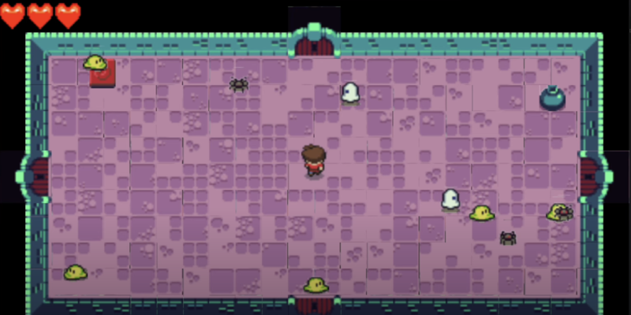

# The Legend of Zelda

A top-down dungeon crawler inspired by the classic Legend of Zelda games, built with LÖVE2D for CS50's Game Development course.



## Description

This project recreates the feel of old-school Zelda titles, with dungeon exploration, sword combat, room-based movement, and enemy AI. The player can lift pots, swing a sword, and collect powerups while navigating procedurally linked rooms.

Features include:

- Room-by-room dungeon transitions
- Sword combat and hit detection
- Enemies with simple AI behaviors
- Pot lifting and throwing mechanics
- Heart-based health system and collectibles

## How to Play

### Controls

- `Arrow Keys`: Move  
- `Space`: Swing sword  
- `Enter`: Interact (lift pot, open door)  

### Objective

Explore the dungeon, defeat enemies, collect powerups, and survive as long as possible.

## Development

### Built With

- [LÖVE2D](https://love2d.org/) — 2D game framework  
- Lua — Programming language  
- Object-oriented and state-driven architecture  
- Procedural room/dungeon generation

### Project Structure

- `main.lua` — Game entry point  
- `src/` — Logic, entities, world, and states  
- `lib/` — Class libraries (`push`, `knife`, etc.)  
- `graphics/` — Spritesheets and character animations  
- `sounds/` — Sound effects and background music  
- `fonts/` — Pixel-style fonts and retro UI assets

## Installation and Running

1. [Download and install LÖVE2D](https://love2d.org/)
2. Clone the repository:
   ```bash
   git clone https://github.com/ethanperello/legend-of-zelda.git
   ```
3. Run the game:
   ```bash
   love legend-of-zelda
   ```

## Demo

[Watch the gameplay demo](https://www.youtube.com/watch?v=grg8zPM8IXQ)

## Credits

- Developed by Ethan Perello  
- Created as part of CS50's Game Development course  
- Visual and sound assets inspired by classic Zelda games
